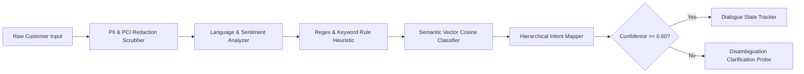
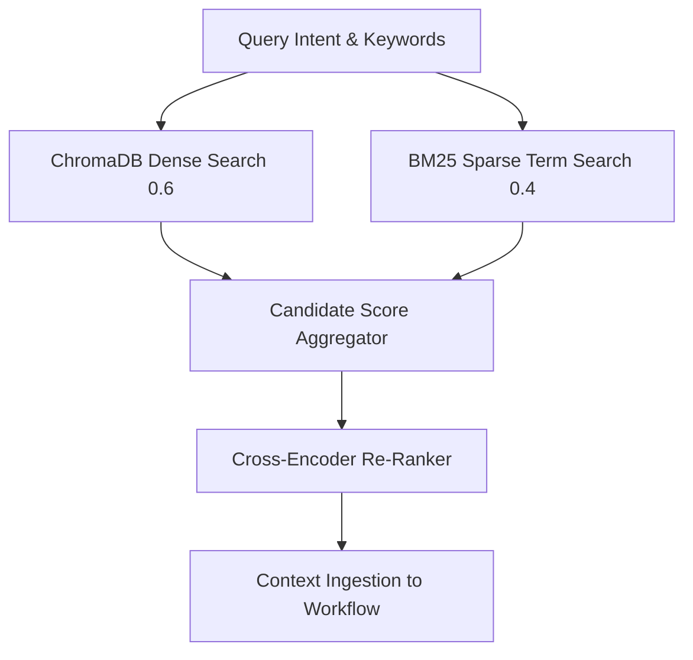
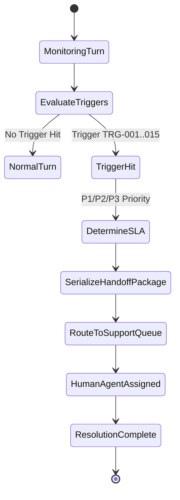

# 🎨 Architecture Diagrams & Visual Specifications

**Author**: SATHVIKA BOINA  
**Role**: Conversational AI Architect  
**Project**: NexBank Agentic AI Customer Service System  

---

## 1. NLU Intent Classification & Entity Extraction Pipeline

---

## 2. Hybrid RAG Retrieval Engine

---

## 3. Human Escalation Handoff State Machine

