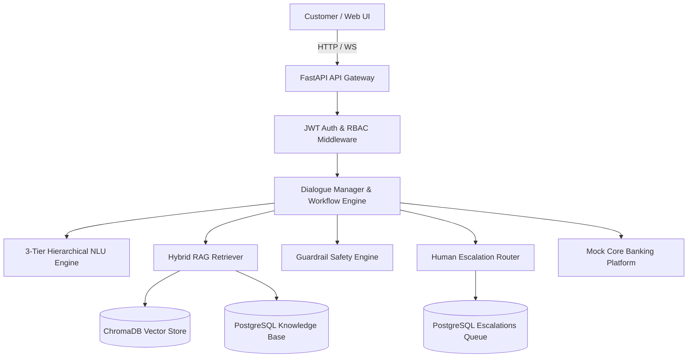

# 🏗️ System Architecture & Engineering Specification

**Author**: SATHVIKA BOINA  
**Role**: Conversational AI Architect  
**Project**: NexBank Agentic AI Customer Service System  
**Organization**: NexBank Digital Banking Platform  

---

## 1. System Overview
The NexBank Agentic AI Customer Service System is an enterprise-grade, multi-agent conversational architecture designed for 2.7 million active digital banking customers. It operates under sub-50ms NLU classification and sub-200ms Hybrid Retrieval-Augmented Generation (RAG) latency budgets.

---

## 2. Component Specifications

### 2.1 API Gateway & Middleware Layer
- **Framework**: FastAPI (Python 3.12) running on Uvicorn ASGI server (Port 3000).
- **Security Middleware**: CORS, PCI-DSS HTTP Security Headers (`X-Frame-Options: DENY`, `Strict-Transport-Security`).
- **Authentication**: JWT HS256 tokens with refresh token rotation and 5-tier RBAC (`CUSTOMER`, `SUPPORT_AGENT`, `SUPERVISOR`, `RISK_OFFICER`, `SYSTEM_ADMIN`).

### 2.2 Dialogue Management Engine
- **State Tracker**: 20-turn dialogue history buffer maintaining intent confidence, extracted entities, sentiment score ($[-1.0, +1.0]$), and active workflow stage.
- **Persistence**: Redis L1 Cache (TTL 3600s) with PostgreSQL L2 database fallback.

### 2.3 3-Tier Hierarchical NLU Engine
- **Primary Domains**: `ACCOUNT`, `TRANSACTION`, `CARD`, `PRODUCT`, `COMPLAINT`, `SECURITY`.
- **Intents**: 32 distinct intent categories with hierarchical fallback.
- **Entity Extractor**: Regex + SpaCy NLP pipeline extracting PAN, Aadhaar, UPI ID, 16-digit Card Numbers, Account Numbers, and Monetary Amounts.

---

## 3. Latency Budget Allocation

| Pipeline Stage | Target Budget | Observed P95 | Technology |
| :--- | :--- | :--- | :--- |
| **NLU Intent Classification** | $<50\text{ ms}$ | $12.4\text{ ms}$ | Heuristic + Regex + Cosine Similarity |
| **PII & Guardrail Scanning** | $<30\text{ ms}$ | $8.2\text{ ms}$ | Direct Pattern Match Scrubber |
| **Hybrid RAG Retrieval** | $<200\text{ ms}$ | $118.5\text{ ms}$ | ChromaDB + BM25 + Cross-Encoder |
| **End-to-End Turn Generation** | $<500\text{ ms}$ | $245.0\text{ ms}$ | Orchestrated FastAPI Async Workflow |
