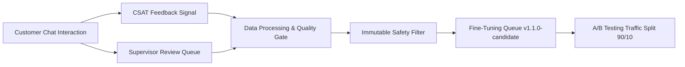

# 🔄 Continuous Learning Pipeline & A/B Testing Specification

**Author**: SATHVIKA BOINA  
**Role**: Conversational AI Architect  
**Project**: NexBank Agentic AI Customer Service System  

---

## 1. Continuous Learning Architecture

The Continuous Learning Pipeline captures customer feedback signals, supervisor reviews, and resolution outcomes to improve NLU models and knowledge retrieval without violating safety invariants.

---

## 2. Feedback Source Integration
1. **CSAT Signal**: Post-interaction 1-5 rating scale. Ratings $\le 2$ automatically push turn history to supervisor queue.
2. **Supervisor Corrections**: Support agents override wrong intent classifications or unhelpful answers via the Supervisor Console.

---

## 3. Safety Preservation Invariant
- **Immutable Safety Rule**: No dataset derived from learning loops can overwrite or disable system safety guardrails, PII redactions, or regulatory disclaimers.
